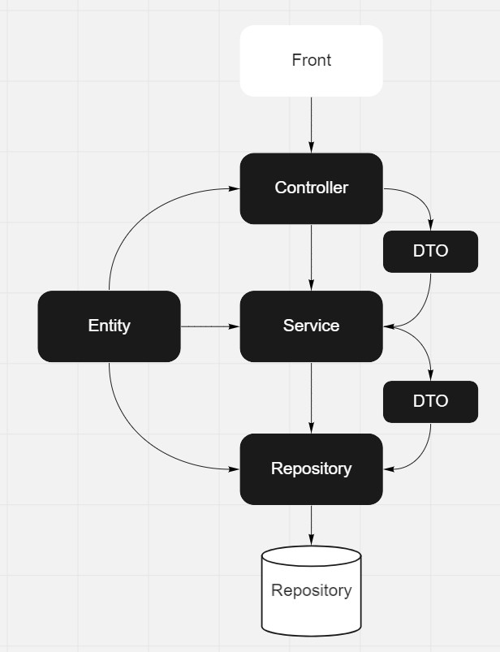
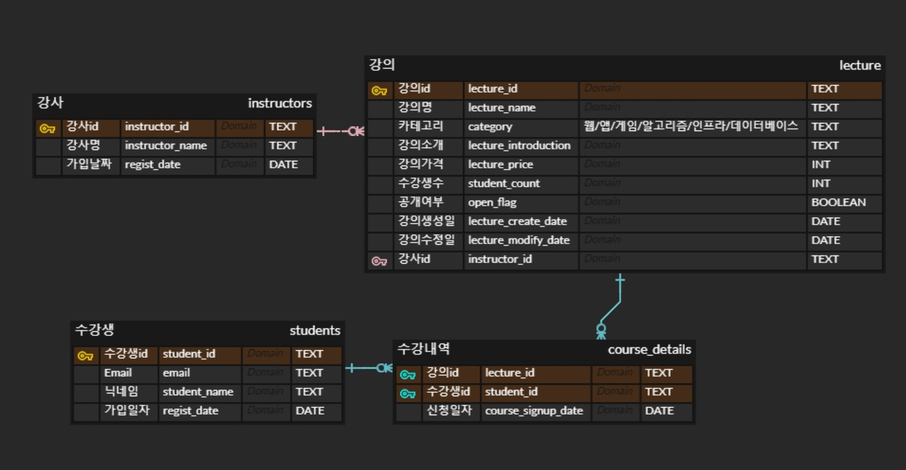

### 강의 플랫폼 backEnd 개발

## 목표

- 객체지향 학습
- DI 활용
- DDD(Domain-Driven Design) 학습
- unit test 학습
- 최대한 라이브러리를 쓰지않은 프로젝트
- frameWork 사용 지양
- 온라인 강의 비즈니스 API 개발 (깃허브)
- 아키텍쳐
  

# 1. api 설계

- URI는 명사를사용
- HTTP Method(GET, POST, PUT, DELETE 등)으로 표현
- 사용된 Method
  GET: 조회 (받겠다)
  POST: 리소스 생성
  PUT: 리소스 전체 갱신
  PATCH: 리소스 부분 갱신
  DELETE: 리소스 삭제

- status
  200: 성공(success), GET, PUT
  201: 작성됨(created), POST
  204: 내용 없음 (No Conent), DELETE
  400: 잘못된 요청 (Bad Request)
  401: 권한 없음 (Unauthorized)
  404: 찾을 수 없음 (Not found)
  409: 충돌 (Conflict)
  5XX: 내가 문제임
  500: 서버 에러 (Interel server error)

# 2. ERD

- ERD 다이어그램
  ERD.jpg
  

- 강사(instructors)

  - 컬럼명 / 타입 / 제약조건
  - 강사id(instructor_id) / TEXT / PK
  - 강사명(instructor_name) / TEXT / NOTNULL
  - 가입날짜(regist_date) / DATE / NOTNULL

- 강의(lectures)

  - 컬럼명 / 타입 / 제약조건
  - 강의id(lecture_id) / TEXT / PK
  - 강의명(lecture_name) / TEXT / UNIQUE / NOTNULL
  - 카테고리(category) / TEXT / CHECK(web/app/game/algo/infra/db) / NOTNULL
  - 강의소개(lecture_introduction) / TEXT
  - 강의가격(lecture_price) / INT / NOTNULL
  - 수강생수(student_count) / INT / NOTNULL
  - 공개여부(open_flag) / BOOLEAN / NOTNULL
  - 강의생성일(lecture_create_date) / DATE / NOTNULL
  - 강의수정일(lecture_modify_date) / DATE
  - 강사id(instructor_id) / TEXT / FK

- 학생(students)

  - 컬럼명 / 타입 / 제약조건
  - 수강생id(student_id) / TEXT / PK
  - email(email) / TEXT / UNIQUE NOTNULL
  - 닉네임(student_name) / TEXT / NOTNULL
  - 가입일자(regist_date) / DATE / NOTNULL

- 수강내역(course_details)
  - 컬럼명 / 타입 / 제약조건
  - 강의id() / TEXT / PK FK
  - 수강생id() / TEXT / PK FK
  - 신청일자() / DATE / DEFAULT(current_date) / NOTNULL

# 3. 실행방법

Window 환경

- npm i (패키지 라이브러리 설치)
- postgresql 다운 (https://www.postgresql.org/download/)
- database dbeaver 다운 (https://dbeaver.io/download/)
- postgresql 설치
- npm run start (서버 실행)
- npm run test (테스트코드 실행)

<!-- 2022/03/03
StudentsRepository에서 repository API가 재대로 작동하지 않음 - createQueryBuilder()를 사용하여 생성
수강생 가입, 탈퇴, 수강신청 기능 개발
TODO studentService test 코드작성, ErrorState 개발

 2022/03/04
typescript Jest config
studentService test 코드작성완료
TODO lectureService 개발

2022/03/05
lectureService
searchCondition 개발 searchCondition Test 코드 작성
searchDetail 개발
TODO searchDetail test 코드 작성, lectureService create delete 개발

2022/03/06
lectureService create 개발
TODO lectureService create Test 코드 작성, lectureService update, delete 개발
lectureService update, delete 개발,테스트코드 완료 -->
